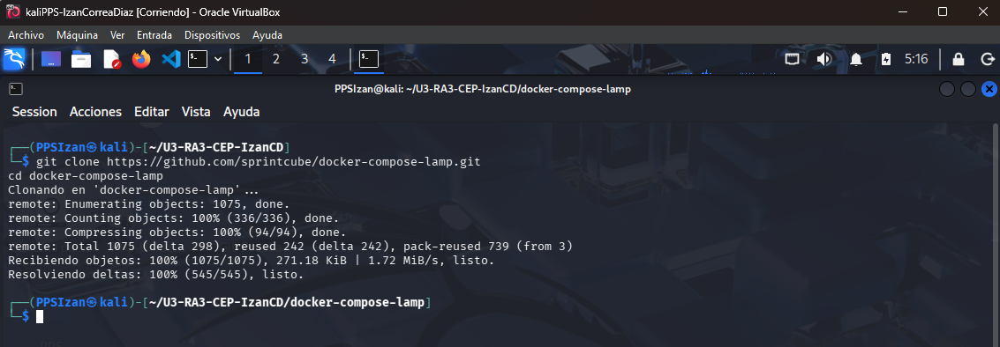
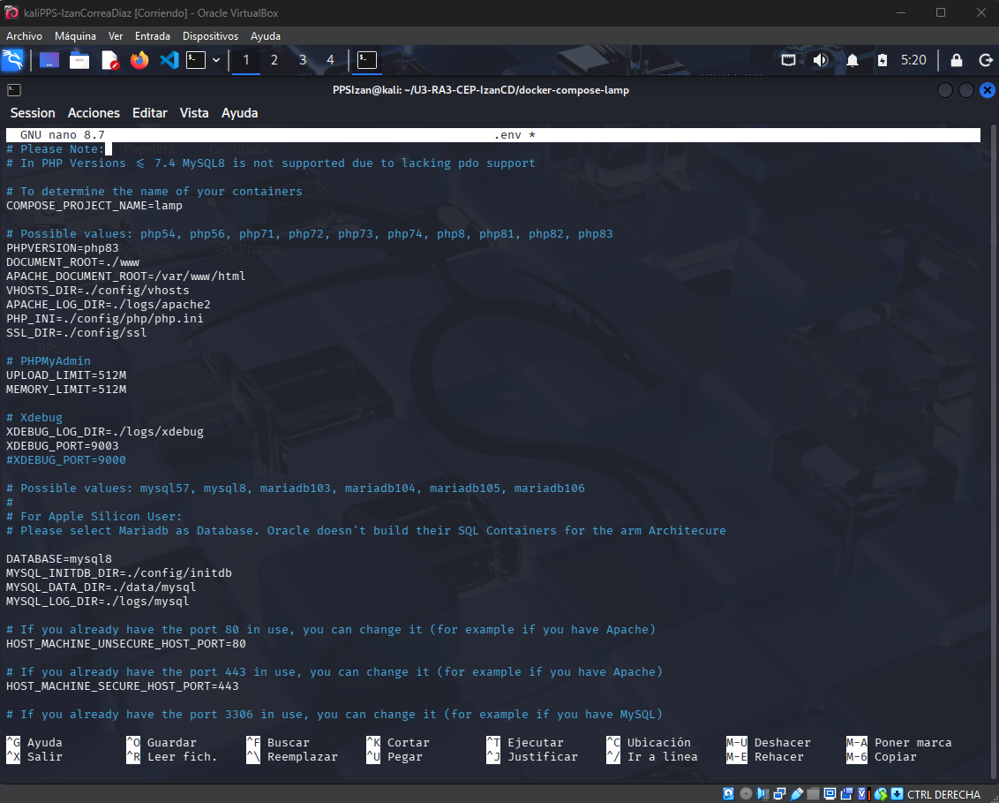
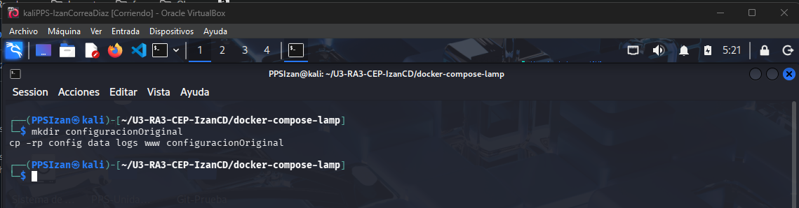
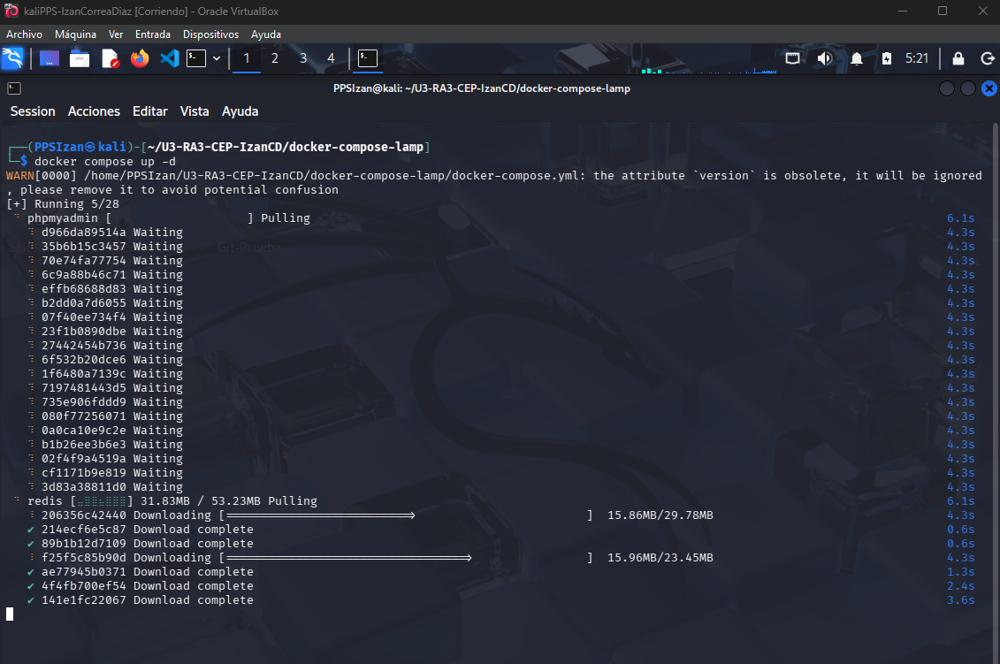
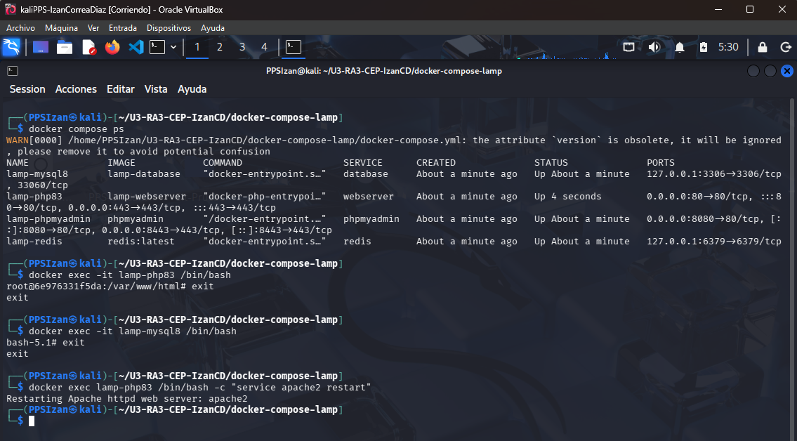
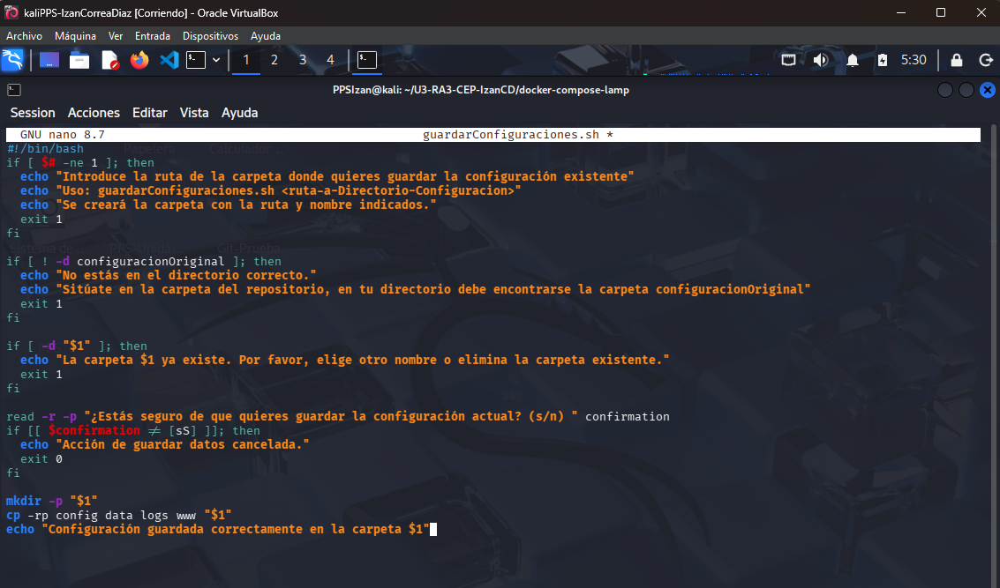
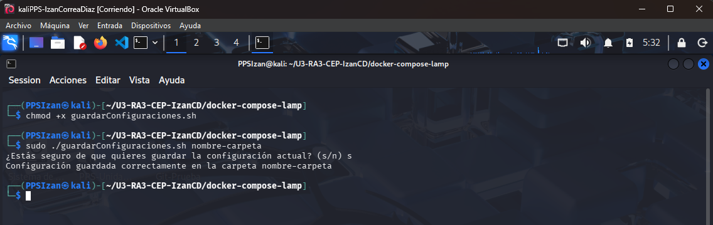
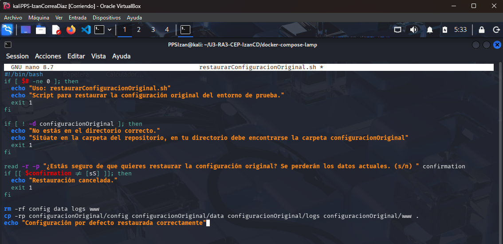
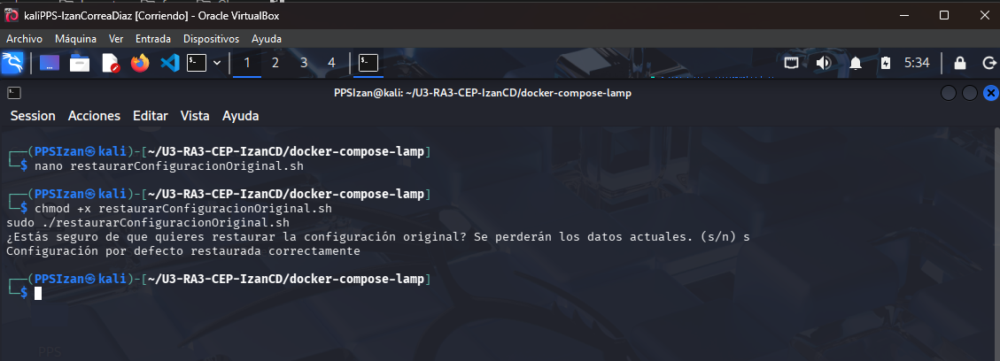
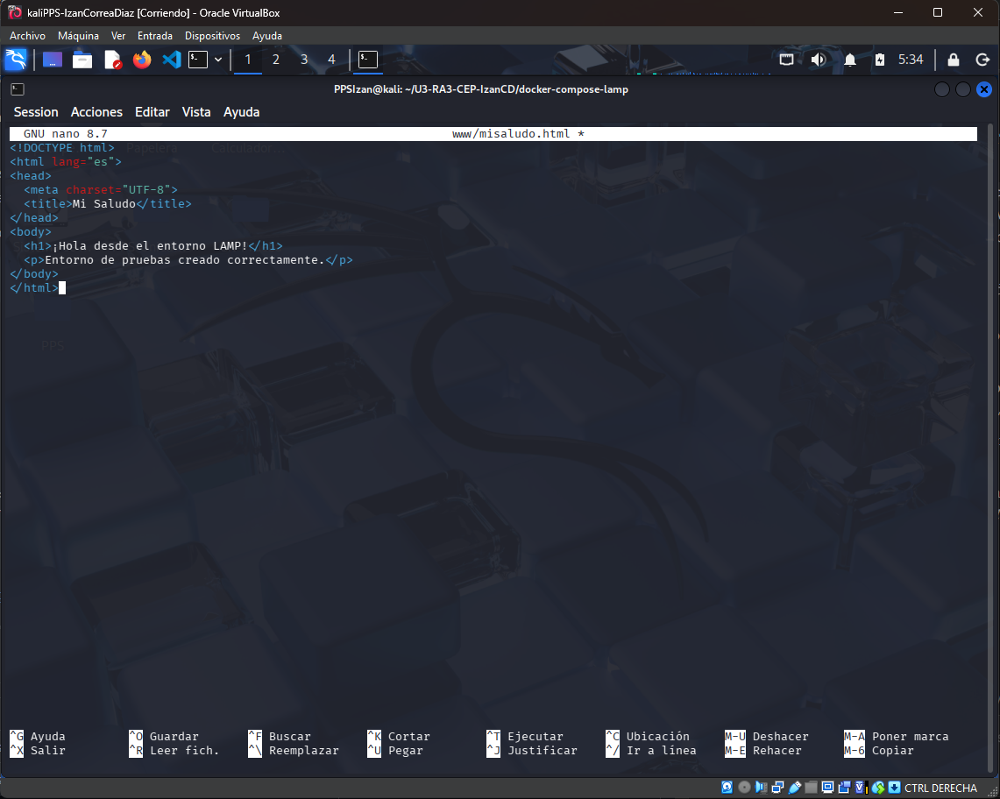

# Creación del Entorno de Pruebas - Puesta en Producción Segura

**Unidad 3 | Autor: Izan Correa Diaz**

---

## Índice

1. [Clonar el repositorio](#1-clonar-el-repositorio)
2. [Configurar el archivo .env](#2-configurar-el-archivo-env)
3. [Guardar copia de la configuración original](#3-guardar-copia-de-la-configuración-original)
4. [Levantar el escenario multicontenedor](#4-levantar-el-escenario-multicontenedor)
5. [Verificar los contenedores](#5-verificar-los-contenedores)
6. [Scripts de gestión de configuraciones](#6-scripts-de-gestión-de-configuraciones)
7. [Modo de trabajo en el entorno](#7-modo-de-trabajo-en-el-entorno)

---

## 1. Clonar el repositorio

Clonamos el repositorio del escenario LAMP multicontenedor:

```bash
git clone https://github.com/sprintcube/docker-compose-lamp.git
cd docker-compose-lamp
```



---

## 2. Configurar el archivo .env

Copiamos el archivo de ejemplo y lo editamos:

```bash
cp sample.env .env
nano .env
```

Modificamos los valores por defecto para seguir buenas prácticas de seguridad (evitar configuración insegura, OWASP Top 10):

```env
# Please Note:
# In PHP Versions <= 7.4 MySQL8 is not supported due to lacking pdo support

# To determine the name of your containers
COMPOSE_PROJECT_NAME=lamp

# Possible values: php54, php56, php71, php72, php73, php74, php8, php81, php82, php83
PHPVERSION=php83
DOCUMENT_ROOT=./www
APACHE_DOCUMENT_ROOT=/var/www/html
VHOSTS_DIR=./config/vhosts
APACHE_LOG_DIR=./logs/apache2
PHP_INI=./config/php/php.ini
SSL_DIR=./config/ssl

# PHPMyAdmin
UPLOAD_LIMIT=512M
MEMORY_LIMIT=512M

# Xdebug
XDEBUG_LOG_DIR=./logs/xdebug
XDEBUG_PORT=9003
#XDEBUG_PORT=9000

# Possible values: mysql57, mysql8, mariadb103, mariadb104, mariadb105, mariadb106
#
# For Apple Silicon User: 
# Please select Mariadb as Database. Oracle doesn't build their SQL Containers for the arm Architecure

DATABASE=mysql8
MYSQL_INITDB_DIR=./config/initdb
MYSQL_DATA_DIR=./data/mysql
MYSQL_LOG_DIR=./logs/mysql

# If you already have the port 80 in use, you can change it (for example if you have Apache)
HOST_MACHINE_UNSECURE_HOST_PORT=80

# If you already have the port 443 in use, you can change it (for example if you have Apache)
HOST_MACHINE_SECURE_HOST_PORT=443

# If you already have the port 3306 in use, you can change it (for example if you have MySQL)
HOST_MACHINE_MYSQL_PORT=3306

# If you already have the port 8080 in use, you can change it (for example if you have PMA)
HOST_MACHINE_PMA_PORT=8080
HOST_MACHINE_PMA_SECURE_PORT=8443

# If you already has the port 6379 in use, you can change it (for example if you have Redis)
HOST_MACHINE_REDIS_PORT=6379

# MySQL root user password
MYSQL_ROOT_PASSWORD=tiger

# Database settings: Username, password and database name
#
# If you need to give the docker user access to more databases than the "docker" db 
# you can grant the privileges with phpmyadmin to the user.
MYSQL_USER=docker
MYSQL_PASSWORD=docker
MYSQL_DATABASE=docker
```

> **Nota de seguridad:** Cambiar puertos, contraseñas y nombres de usuario por defecto es esencial para mitigar vulnerabilidades de **Configuración Insegura** recogidas en el OWASP Top 10.



---

## 3. Guardar copia de la configuración original

Antes de levantar el escenario, creamos una copia de respaldo de la configuración original:

```bash
mkdir configuracionOriginal
cp -rp config data logs www configuracionOriginal
```



---

## 4. Levantar el escenario multicontenedor

```bash
docker compose up -d
```

Accedemos al servidor web en el navegador:

- HTTP: [http://localhost:8080](http://localhost:8080)
- HTTPS: [https://localhost:8443](https://localhost:8443)
- phpMyAdmin: [http://localhost:8181](http://localhost:8181)



---

## 5. Verificar los contenedores

Comprobamos que los 4 servicios están corriendo correctamente:

```bash
docker compose ps
```

Resultado esperado — deben aparecer los siguientes contenedores en estado `running`:

| Contenedor | Servicio |
|---|---|
| lamp-php83 | Servidor web Apache + PHP 8.3 |
| lamp-mysql8 | Base de datos MySQL 8 |
| lamp-phpmyadmin | Interfaz web de administración de BBDD |
| lamp-redis | Base de datos Redis (caché) |

Para acceder al interior de un contenedor:

```bash
# Acceder al servidor web
docker exec -it lamp-php83 /bin/bash

# Acceder a la base de datos
docker exec -it lamp-mysql8 /bin/bash
```

Para reiniciar Apache dentro del contenedor web si es necesario:

```bash
docker exec lamp-php83 /bin/bash -c "service apache2 restart"
```


---

## 6. Scripts de gestión de configuraciones

### Script: guardarConfiguraciones.sh

Guarda las configuraciones actuales del escenario en una carpeta con el nombre indicado.

```bash
nano guardarConfiguraciones.sh
```

Contenido del script:

```bash
#!/bin/bash
if [ $# -ne 1 ]; then
  echo "Introduce la ruta de la carpeta donde quieres guardar la configuración existente"
  echo "Uso: guardarConfiguraciones.sh <ruta-a-Directorio-Configuracion>"
  echo "Se creará la carpeta con la ruta y nombre indicados."
  exit 1
fi

if [ ! -d configuracionOriginal ]; then
  echo "No estás en el directorio correcto."
  echo "Sitúate en la carpeta del repositorio, en tu directorio debe encontrarse la carpeta configuracionOriginal"
  exit 1
fi

if [ -d "$1" ]; then
  echo "La carpeta $1 ya existe. Por favor, elige otro nombre o elimina la carpeta existente."
  exit 1
fi

read -r -p "¿Estás seguro de que quieres guardar la configuración actual? (s/n) " confirmation
if [[ $confirmation != [sS] ]]; then
  echo "Acción de guardar datos cancelada."
  exit 0
fi

mkdir -p "$1"
cp -rp config data logs www "$1"
echo "Configuración guardada correctamente en la carpeta $1"
```



Dar permisos de ejecución y usar:

```bash
chmod +x guardarConfiguraciones.sh
./guardarConfiguraciones.sh nombre-carpeta
```



### Script: restaurarConfiguracionOriginal.sh

Restaurar la configuración original del escenario (deshace los cambios de una actividad).

```bash
nano restaurarConfiguracionOriginal.sh
```

Contenido del script:

```bash
#!/bin/bash
if [ $# -ne 0 ]; then
  echo "Uso: restaurarConfiguracionOriginal.sh"
  echo "Script para restaurar la configuración original del entorno de prueba."
  exit 1
fi

if [ ! -d configuracionOriginal ]; then
  echo "No estás en el directorio correcto."
  echo "Sitúate en la carpeta del repositorio, en tu directorio debe encontrarse la carpeta configuracionOriginal"
  exit 1
fi

read -r -p "¿Estás seguro de que quieres restaurar la configuración original? Se perderán los datos actuales. (s/n) " confirmation
if [[ $confirmation != [sS] ]]; then
  echo "Restauración cancelada."
  exit 1
fi

rm -rf config data logs www
cp -rp configuracionOriginal/config configuracionOriginal/data configuracionOriginal/logs configuracionOriginal/www .
echo "Configuración por defecto restaurada correctamente"
```



Dar permisos de ejecución y usar:

```bash
chmod +x restaurarConfiguracionOriginal.sh
./restaurarConfiguracionOriginal.sh
```



---

## 7. Modo de trabajo en el entorno

Gracias a los **bind mounts** definidos en el `docker-compose.yml`, los archivos del servidor web se guardan localmente en la carpeta `www/`. Esto permite:

- Crear/editar archivos directamente en `www/` sin entrar al contenedor.
- Los cambios se reflejan automáticamente en el servidor web.

Ejemplo — crear un archivo HTML de prueba:

```bash
nano www/misaludo.html
```

Contenido de ejemplo:

```html
<!DOCTYPE html>
<html lang="es">
<head>
  <meta charset="UTF-8">
  <title>Mi Saludo</title>
</head>
<body>
  <h1>¡Hola desde el entorno LAMP!</h1>
  <p>Entorno de pruebas creado correctamente.</p>
</body>
</html>
```



Acceder en el navegador: [http://localhost:8080/misaludo.html](http://localhost:8080/misaludo.html)

---

## Resumen de carpetas del proyecto

| Carpeta | Descripción |
|---|---|
| `www/` | Archivos del servidor web (DocumentRoot) |
| `config/` | Archivos de configuración (PHP, Apache, MySQL, vhosts, SSL) |
| `data/` | Datos de la base de datos MySQL |
| `logs/` | Logs de Apache, MySQL y Xdebug |
| `configuracionOriginal/` | Copia de seguridad de la configuración inicial |

---

*Entorno multicontenedor LAMP levantado y verificado correctamente. Listo para realizar las actividades de la Unidad 3.*
